# Census Data

### Introduction

This module covers an introduction to Census Data. More than other tutorials, this one will teach not as much how to manipulate data once we have it, but how to get it in the first place, followed by some quick operations.

US census data is an amazing effort, and encompasses so much beyond the decennial census effort that we often associate it with. Alongside the decennial census are other products like the American Community Survey (ACS), another data collection effort that conducts in-depth surveys of roughly 1% of the US's population every year, although for the purpose of this tutorial we will refer to both of them as census data.

As a reminder, the 'census data' that we use is really the *summary* of individual responses. We have access to the in-depth data about discrete geographically areas not because everyone that lives there has been surveyed, but rather because the Census Bureau has surveyed a *representative* proportion of the population, and applies *weights* to those responses to come with an estimate for the whole geography. As a quick example, if 5 people out of 20 surveyed in an area make over $x in a calendar year, the Census Bureau will assume that 25% of that area makes over $x in a calendar year (with the caveat that this is drastically oversimplified.)

The data that we will access in this tutorial is a *summary* of those individaul responses. That said, the individual responses themselves, called 'Microdata', are accessible via the Census Bureau's 'Public Use Microdata Sample'. These surveys are stripped of their identifiying charasteristics and only accessible within the PUMA (Public Use Microdata Area) geography, so that they cannot (likely) be used to identify any individuals. The census bureau's [microdata portal](https://data.census.gov/mdat/#/search?ds=ACSPUMS5Y2018) is here, but I also recommend the [iPUMS service](https://www.ipums.org/) from the the University of Minnesota.

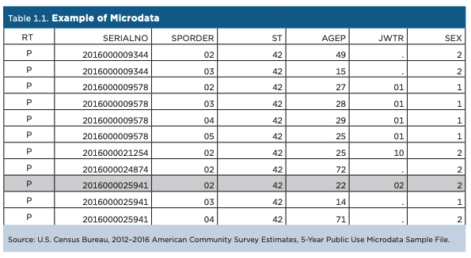

This tutorial is not a comprehensive guide through census data, but rather a quick tour through finding data, and working with it in QGIS. Within it, we will attempt to map the survey collection of five years of the ACS, and try to understand the survey's sample size vs. the projected population of census tracts in New York City. This tutorial is written from the perspective of someone who does not yet know which specific datasets they want to access, and is searching in an exploratory manner.

### Setup

As usual, start a folder for this tutorial with two folders for your data: `original` and `processed`. Open up QGIS, start a new project, set the CRS to `epsg:2263`, and save the project in that folder, so it is at the same level of your two data folders.

### Accessing Census Data

The United States Census Bureau has a data portal named [data.census.gov](https://data.census.gov/), a subdomain of (data.gov)[https://data.gov], the site that the federal government is trying to federal data collection efforts under. Data.census.gov replaced American Fact Finder in 2020, but is still very much a work in progress. In truth, at the time of writing, data.census.gov is wildly overdesigned, and is not particularly adept at finding about statistics about an *area* before mapping it in depth. However, if you already know the general subject that you would like to map and the geography, it is quite good at helping you find the right datasets. 

In this way, you can see that it was designed as a *dataset* exploration tool, and not really one to *explore with data*. For sites that are better for the latter, I recommend [censusreporter](https://censusreporter.org/), [datausa.io](https://datausa.io/) (which is the best tool for exploring microdata), and [social explorer](https://www.socialexplorer.com/) (which is a paid service, but CU students have free access.)

### Performing a Search

There are multiple ways to search on data.census.gov. The first is called `simple search,` the second `advanced search.` In this tutorial we will start with a simple search, and then filter it from there using the advanced search. If you plan on using Census Data more after this, I recommend visiting their guides [here](https://www.census.gov/data/what-is-data-census-gov.html), specifically [this one](https://www.youtube.com/watch?v=QtdmnysIKcQ) on search.

Search for “sample size” in the simple search.

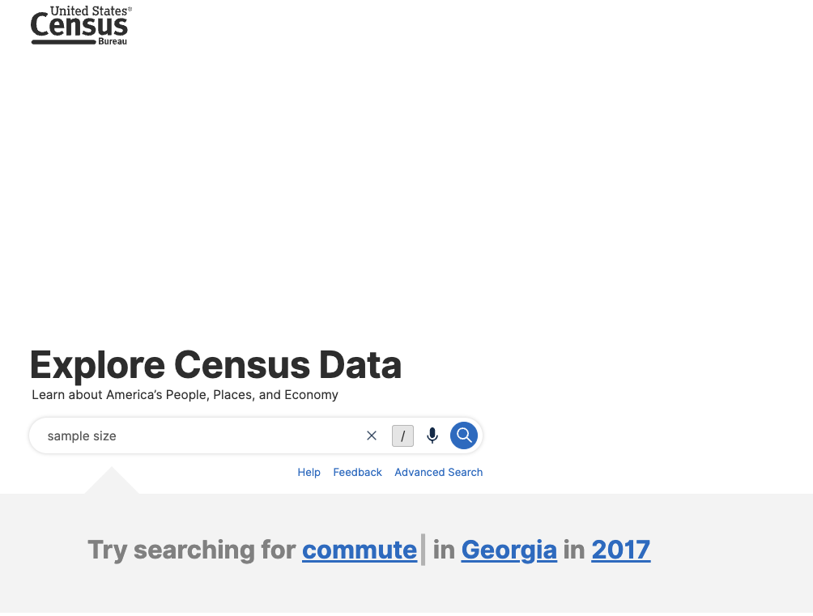

After our search, we see a number of datasets show up:

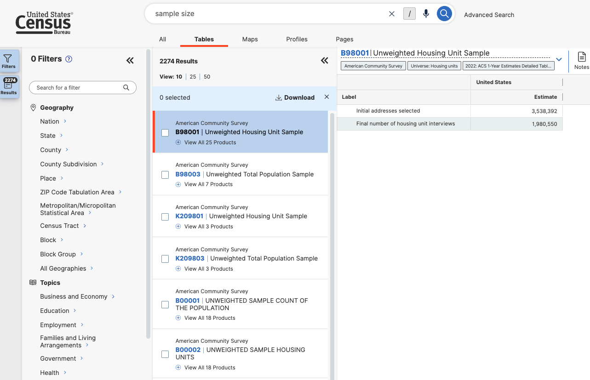

### Refining Search to Selected Geographies

Now that we've searched for data. Let's see what is available in our geography of choice: New York City census tracts.

On the left side bar (which is the `advanced search`), click `census tract`, go to `New York State`, and then `New York County` (Manhattan.) Click `All Census Tracts within New York County` and then go back. Do the same for these counties:

- Kings (Brooklyn)
- Queens
- Bronx
- Richmond (Staten Island)

Once you are finished, you should have 5 Filters on the `Filters` bar docked to the left. You will also notice that the available datasets have reduced.

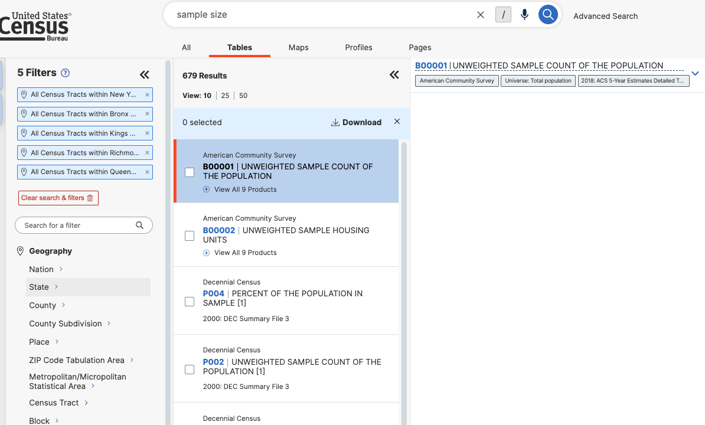

### Selecting a Dataset

We have a list of data to our right. Click `B00001-UNWEIGHTED SAMPLE COUNT OF THE POPULATION`. 

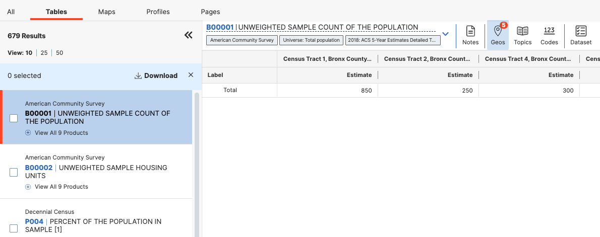

The name sounds like what I am looking for - the sample size of people surveyed for a census. I see that it is part of the American Community Survey 5 year survey, so is available in yearly increments stopping at 2018. What does the data look like? Open the table up and take a look. I see a column for each census tract, with an `estimate` for the population of each. I do not understand about this dataset is why it is an estimate—presumably if it is an unweight sample it must be the samples themselves? I check out the data table (after downloading) and still don't fully understand, I understand that it is a estimate based off of an actual sample, but my question isn't fully answered. That said, the numbers seem right for what I would expect, given that the ACS surveys 1 in 12 households every year - and if you strip the geographies the national count in the dataset is 26 million. My guess is that because microdata is only available at the PUMA geography, this is likely an apportionment of the sample count of a PUMA (which is a larger geography) among census stracts based off of their relative population counts in a previous census.

I decide that for my purposes, a very quick check of sample vs actual, this will do. That said, using this dataset to make decisions or as the foundation of research would certainly require additional context. Click `zip` and download the dataset, select `2018` as the year, as it is the most recently available. I recommend download the zip over the other formats, because the zip comes with a data dictionary in the same folder. Put the unzipped folder into your `original` folder.

### Downloading a TIGER/line shapefile

Census data is designed to work with shapefiles of administrative geographies. Those geographies are published as TIGER/line shapefiles. Because these districts are subject to political processes, they change, and you always have to pay attention to the year that your data is from matches the year your shapefile is from. There is a lot more standardization after the year 2000 (the whole US wasn't even covered by census tracts until then,) but you will still run into `null` values at times from mismatched years. 

Go to the Census Bureau's [website](https://www.census.gov/geographies/mapping-files/time-series/geo/tiger-line-file.html). Navigate to “Download”, click web interface, or follow this [link](https://www.census.gov/cgi-bin/geo/shapefiles/index.php). Once you are there, select `2018` for year, and `census tracts` for layer type. At the following page, select new york for the state. Download the shapefile, and put it in your `processed` folder.

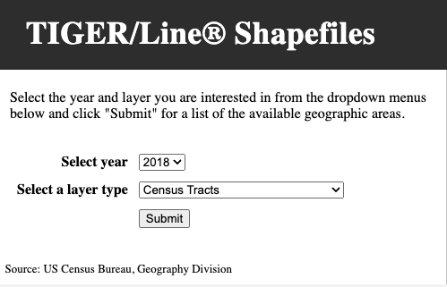

### Importing dataset, specifying datatype

Now let's bring our datasets into QGIS.

Given that we have covered importing both vector and tabular datasets in [Tutorial 1](https://centerforspatialresearch.github.io/methods-in-spatial-research-sp2024/tutorials/mapping-where), I will skip those steps here and just mention the important things.

First import your shape file by dragging and dropping, or through `Layer` > `Add layer` > `Add Vector Layer`. 

Next, add the tabular `B00001` census dataset, a .csv of which you have in your `original` data folder. Do not drag and drop this dataset, but rather add it through `Layer` > `Add layer` > `Add Delimited Text Layer`. QGIS tends to make more inferences about the data type of each layer when you drag and drop, and we want to specify one of those columns.

In the resulting window, check the options here, and make sure that you mark column `B00001_001E` as an `integer`. Either 32 or 64 bit will do in this case, but if it was a number in the tens of millions, you would want it to be 64. You really can't go wrong with 64 ever, although it uses more memory (which does not matter for most cases, but you should keep in mind if you start working with very large dataset and compute becomes an issue.)

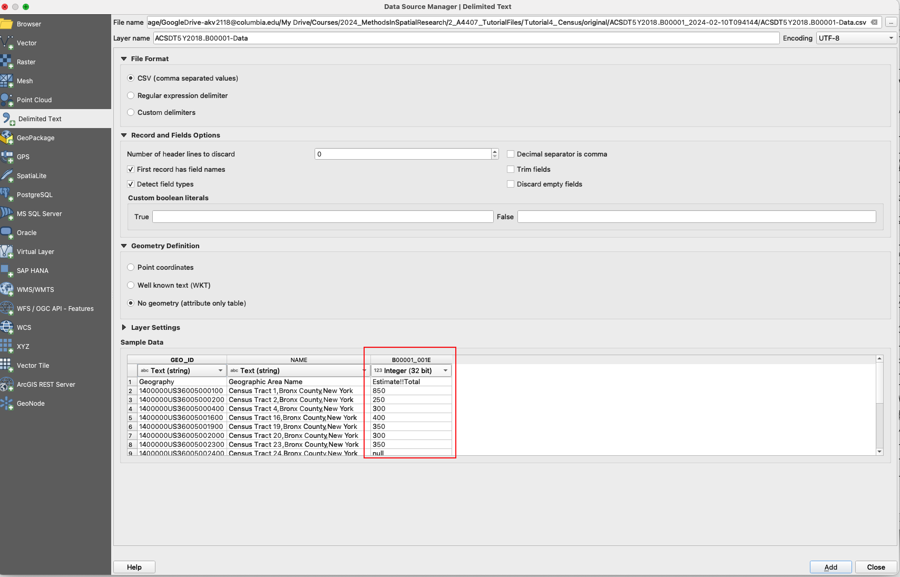

### Performing a vector join

Both datasets are added! Now let's join them to eachother. We have done this before in [Tutorial 1](https://centerforspatialresearch.github.io/methods-in-spatial-research-sp2024/tutorials/mapping-where), so I will breifly describe the redundant steps.

As a reminder, you will be joining the tabular dataset **to** the vector dataset. So open up the census tract shapefile by double-clicking on it, browse to `Joins`, and click `Add`.

Here you'll want to join the geographic identifiers together. In the tabular dataset from the census, that dataset is `GEO_ID`, and in the vector dataset, that is `GEOID`. Let's select those two and hit join. 

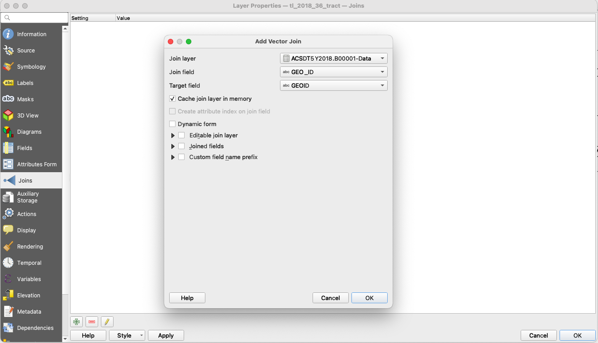

### Troubleshooting

And... it didn't work! If you try to visualize the data with a layer fill - you will not see those fields pop up. What is going on here? 

Let's open up the `attribute table` with a right click on the vector layer that we joined to. We see that two new columns were joined to this dataset, however they all have `null` for a value.

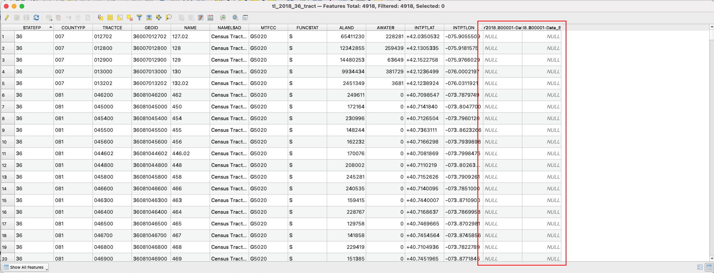

So what happened here? Let's open up both of our attribute tables, and see if we can figure out why the join failed. We see that the two geo id fields look pretty different - specifically that the one from the census has a `1400000US` appended to the front of it. However, after that looks to be the exact same. 

You will run into this all the time with census data. The tabular datasets don't have this, but the TIGER shapefiles do. Even with different datasets and different problems, get used to this process of troubleshooting - if something isn't working, look at the original data and try to think as you are asking the computer to.

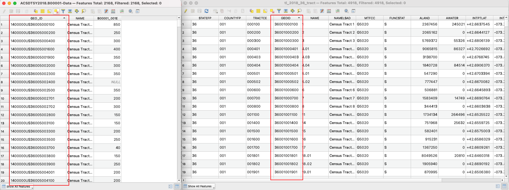

### Adding a new GEOID

We could either take off the `140000US` on the tabular dataset, or add it to the vector. I chose to do the former here, because as it is it is just adding memory that we don't need to use otherwise.

To do that, we should open up the attribute table, and open the field calculator. It has an abacus icon, it says `open field calculator` if you hover over it. There, we create a new field called `GEOID`, so it matches with the vector dataset (but it could be called anything,) and put in the expression field `right(GEO_ID,11)`. What does this mean? `right` is an operation that you can find if you click underneath the `string` category (strings are collections of characters, which are note read as numbers like an `integer` or `double`.) If you read the description there - it says that `right` asks for a string field, and a number to signify how many characters to keep from the right side of a string. Anythign left over it will erase. We put `11` here, because if we think at the field for GEOID in the vector dataset (double click and go to `Fields`,) we see that it is 11 characters long. Altogether, his means that this expression will create a new field called `GEOID`, that contains the string from `GEO_ID` but without the `1400000US`. 

Hit apply, it may take a second to complete.

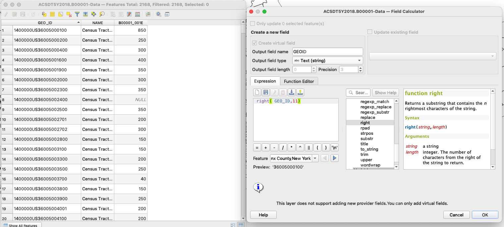

### Mapping the result

Perform the join again by matching the new field `GEOID` from the tabular dataset, with `GEOID` from the vector dataset. After that, let's map the result. I will skip describing the steps to perform a graduated fill layer on the sample estimate field, but if you need a recap, check out tutorial 1. 

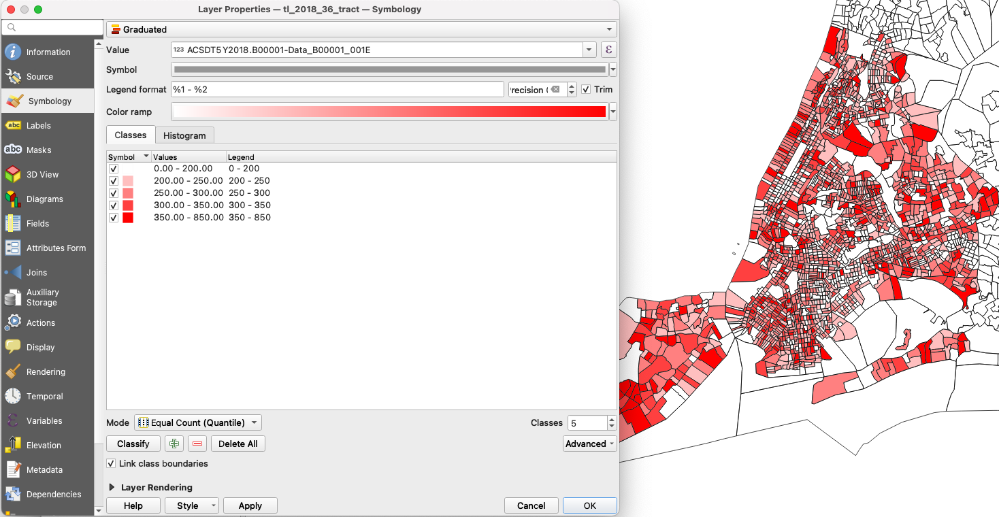

Looking at our map - what do we have? The sample estimates range from 0 to 850, with quite a diverse distribution. One thing that I thought I would see in this map is areas that I may identify as wealthier would have a better response rate. I see some suggestion towards that, but the result seems pretty mixed.

Either way, each of these census tracts has different populations demographics and densities, so on its own this dataset does not tell us much. However, if we could compare the *sample size* to the *population* for each tract, that would give us a general idea of the sample rate per census tract. 

### Getting Another Dataset to Compare

Let's go back to data.census.gov and find a dataset for population. Search for `population` and lets see what comes up. If your geography information isn't saved from your last search, enter those again. 

There are a few results. The first result is from the census, which would work, but it would be ideal if we compared the sample size with population numbers from the 2018 ACS 5-year estimate. The next two datasets, `DP05` and `S01011`, fit that description. In ACS, `S` tables are subject tables, that usually contains multliple fields all around a similar topic, in this case, Age and Sex. `DP` is a data profile, which contains a subset of the most frequently requested datasets around a topic, in this case demographic and housing estimates. 

We only need information on population, so either will do, but I am going to download `DP05`, because it will have additional data that I may want to look at later. Besides, I am looking at a fairly small geography, so I don't have to worry about the datasets becoming so large that they are hard to use. 

Download the dataset, and select `2018` for the year. Put the folder in your `original` data folder.

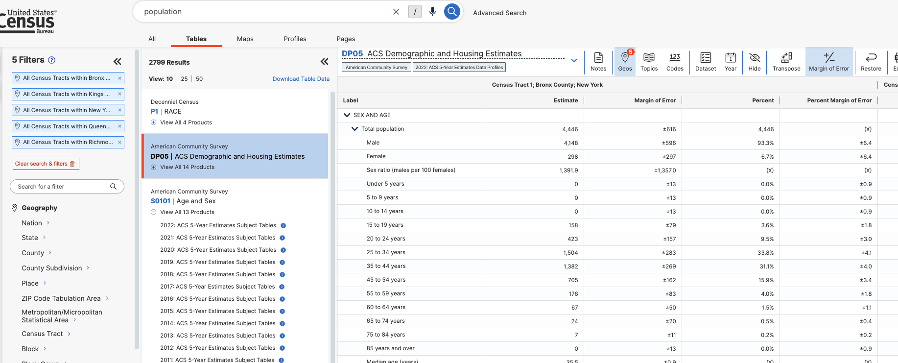

### Adding demographic dataset

Let's add our new csv to the project the same as before. One difference this time: I noticed that, perhaps due to the size of the dataset, QGIS was importing every field as a `text` datatype, even if I specified them as something else in the import window. I assume that this was happening because the first row in the dataset had descriptions for each field. To get around this, I input `1` for `number of header lines to discard` in the import window. This will mean that our `GEO_ID` layer is now called `Geography`, which we'll have to pay attention to at the next step. 

Also, make sure that the `Total Population` field is set to integer. We're only going to use that one, but now would be a good time to look through some of the other fields and make sure that you're importing any you might like to use with the correct datatype.

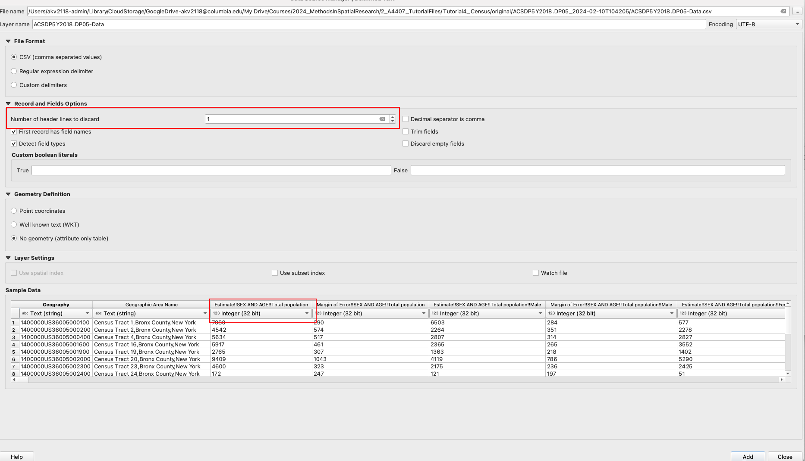

### Making GEO IDS match, Joining to vector dataset

Same as before, let's strip the `1400000US` from the beginning of the `Geography` field using the field calculator. I'll name this new field `GEOID`, same as with the last dataset.

Now that that is done, let's join this dataset to our shapefile - the same one that we have already joined one dataset to.

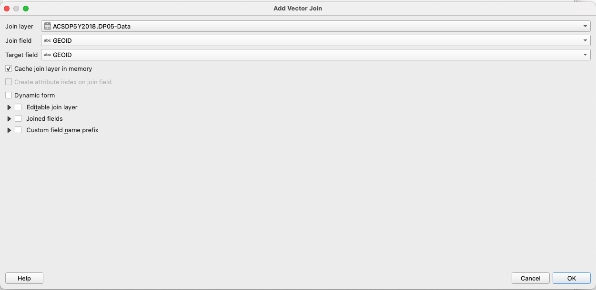

## Looking at our Joined Data

Now let's open up the attribute table of the joined dataset, and check to make sure everything is ok. There are some null fields, but if I scroll I see that the vast majority are completed. That could be happening for many reasons, that would be worth looking into if we needed a very solid analysis, but for our purposes this is ok. 

Our joined dataset now has many, many fields, and is kind of difficult to read. I recommend click on `Organize Columns` next the field calculator, and positioning the two datasets that we are interested in right next to each other, and after the `GEOID`. You don't have to do this, but I just recommend it both for the next step, and for ease of reading.

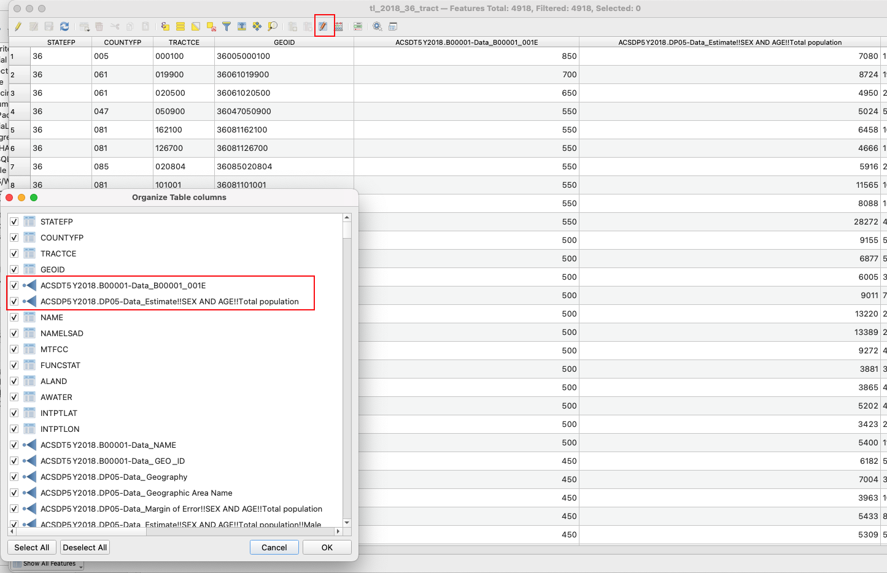
 
Comparing the two datasets - we immediately see that the ratio is not consistent. Looking at the first two rows, the sample size vs actualy population is 12% and 8% respectively. It seems like this might be worthy of looking into a bit more.

### Creating a Sample Percent field

We are really interested in understanding the sample size vs the actual (estimated) population. In order to do that, let's create a new field using the field calculator.

How do you figure that out? Well, we want to get the percentage of the sample size vs the final count. That means our expression should work like Sample Percent = Sample Size / Total Population. Let's name this new field `sample-per`, and also make sure that we select `decimal-number` for the output field type. 

All we have to put in the expression editor is the division of our two datasets. These names are long and complicated, so lets select them using the `Fields and Values` Dropdown in the center menu. It should look like this before you hit `OK`.

`"ACSDT5Y2018.B00001-Data_B00001_001E" / "ACSDP5Y2018.DP05-Data_Estimate!!SEX AND AGE!!Total population"`

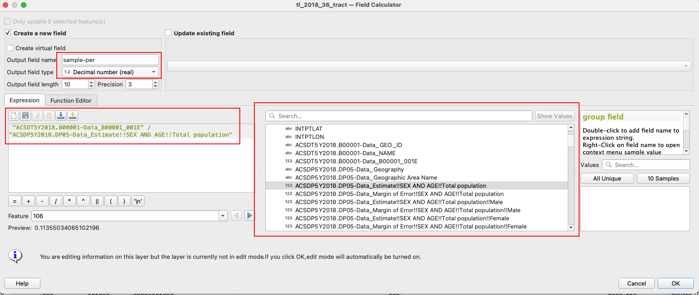

After you finish this check out the new field. It worked! By default, QGIS will shuffle it to the back of your attribute table. I recommend moving it after the fields that you divided to make it so it is more accessible in the next step. You can do this with `Organize Columns` in the attribute table like we did two steps ago.

### Styling and exporting our new map

Now, lets visualize our data. Go to `symbology`, select graduated from the drop down and `sample-per` from the list of fields. Classify the results, equal count will give us three values for census tracts without any samples (there are many census tracts, even in nyc, where no one officially lives,) so I recommend using `Natural Breaks`, aka the Jenks optimization method in statistical circles.

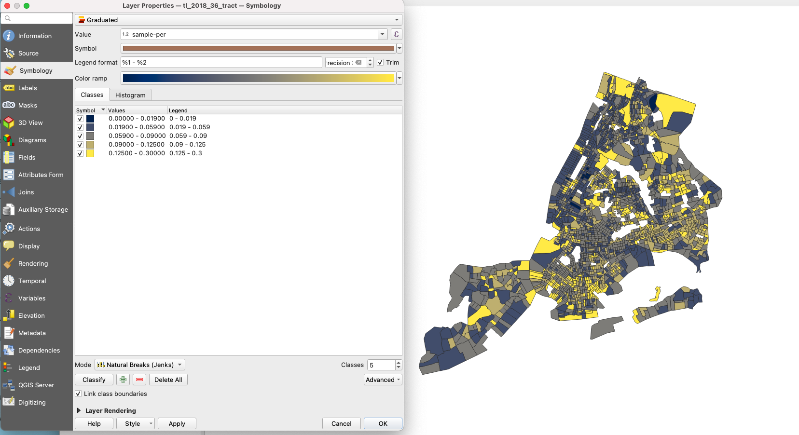

I recommend picking a color ramp that won't lead us to conclusions - for example, a color ramp from white to blue has the effect of telling us that blue areas are good, and white need attention. Conversely, red to white signals that the white areas are fine. In truth, I'm not sure what to make of the results of this dataset yet, so I chose `Cividis`, which is blue to yellow. As a side note, if you ever need help picking the right colors for maps in the future, I highly recommmend [Color Brewer 2](https://colorbrewer2.org/#type=sequential&scheme=BuGn&n=3)

Go ahead and export this map to our `processed` folder, with a right click on the layer, Save Features As, and select the location. This ensures that your work is portable between QGIS projects, and won't get lost in a crash. 

### Adding a water layer

One thing that is confusing about the map, is that census tracts extend over water as well. This makes it difficult to read at times.

Download the [hydrogaphy basemap from NYC Open Data] (https://data.cityofnewyork.us/Environment/HYDRO/pjs3-c3z5/about_data), and add it to your project. Give it a blue-ish color that doesn't contrast with the data.

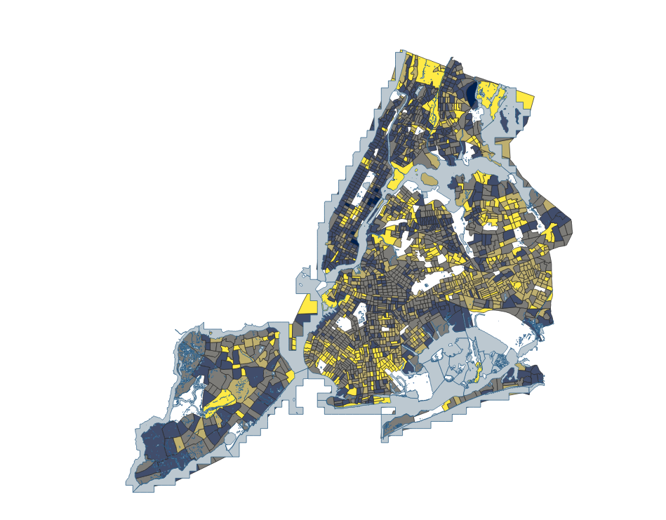

## Final Map

Looking at our final map, what is it telling us? It is actually very interesting, and kind of surprising to me. In many cases, areas that are wealthier seem to have a lower sample size to final population estimate ratio, whereas communities I often think of as underserved sometimes show the opposite. This trend doesn't carry to many places, but why could this be? Is it because perhaps the ACS surveyors believe they have enough supporting data to accurately count the populations in wealthier areas, so they prioritize underserved communities? That would make sense, but it also could potentially mean that perhaps the sample ratio is higher in underserved communities, precisely because they are undercounted, and their population should be higher than in actually is. This map asks many more questions that it solves, which is exactly what you want.

### Challenge

What other datasets could you add to what we have here to ask more questions, or start to provide answers about what our sample percentage means? Some datasets that could do that our:

- Census response rates 
- Internet Access
- Demographic charateristics
- Housing characteristics (renter/owner, vacant/occupied)

Also, it may be helpful to do more background research on the datasets that we have used so far - perhaps something in there can point you in the right direction?

---
Module by Adam Vosburgh, Spring 2024.